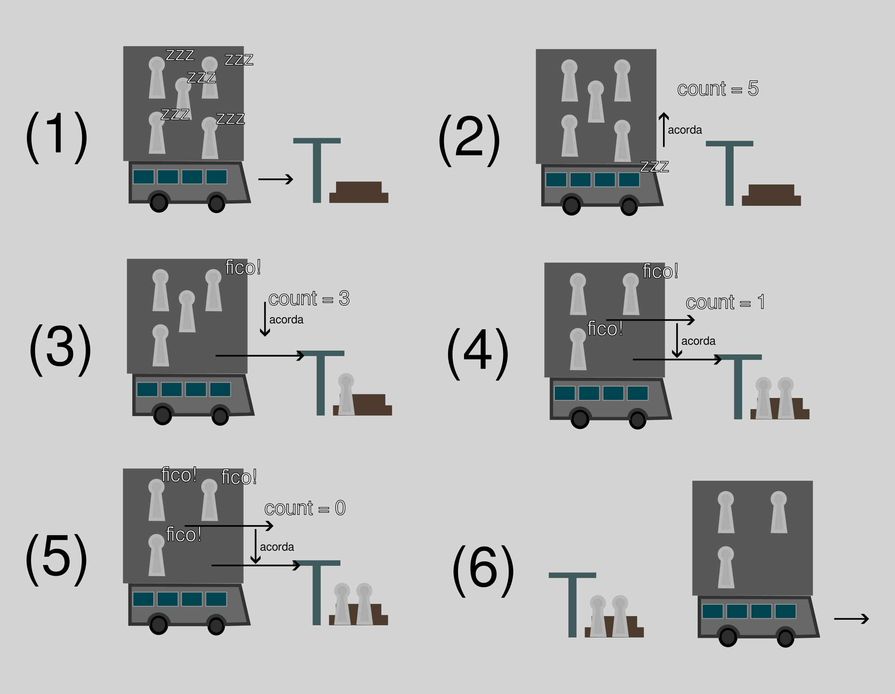

# Bus Ride - SSC0541 - Sistemas Operacionais I

Trabalho da matéria SSC0541 - Sistemas Operacionais I, onde foi implementado uma simulacao de onibus
e passageiros usando conceitos de threads.

## Como Compilar

```bash
make
```

## Como Rodar
```bash
make run <Pontos de Onibus (S)> <Onibus (C)> <Passageiros (P)> <Assentos por Onibus (A)>
```

## Como limpar pastas de compilacao e de rodar o programa
```bash
make clean
```

## Pseudo códigos
Para o planejamento do projeto, foram feitos pseudo códigos do funcionamento da thread do onibus, e do passageiro, eis elas:
- Onibus:
```C
//onibus
id onibus;

id ponto = NENHUM;
id proximo_ponto = rand();
    
semafaro passageiros_th;
semaforo onibus_th;

void onibus(){
  while(executando){
    if(ponto == NENHUM){
      tempo_de_viagem();
      //Tentativa de parar no ponto
      if(tenta_ancorar_no_ponto(proximo_ponto)){
        ponto = proximo_ponto;
      }
      proximo_ponto = (proximo_ponto + 1) % num_pontos;
    }
    else{ // Entrado no ponto...
      //Desembarcar passageiros
      acorda_passageiros() ;
      contador = qtd_de_pessoas_no_onibus;
      while(contador > 0) espera_aviso_de_passageiros();
      //Embarcar passageiros
      while(ha_vaga() && ha_passageiros_no_ponto()){
        acordar_primeiro_da_fila();
        colocar_passageiro_no_onibus();
      }
      //Sai do ponto
      ponto = NENHUM;
    }
  }
  encerra();
}
```

- Passageiro:
```C
//passageiro:
id ponto_inicial;
id ponto_final;
bus *onibus;

void passageiro(){
  //Vai pro ponto inicial
  entra_na_fila_do_ponto();
  salvar_tempo_de_chegada();
  espera_pelo_onibus(dorme);

  //Entra no onibus:
  guardar_onibus();
  sair_da_fila_do_ponto();
  sentar_nos_assentos_do_onibus();
  salvar_tempo_de_embarque();

  //Confere o ponto:
  while(ponto->end_bus != ponto_final->end_bus->id) {
    bus->contador--;
    avisa_onibus();
    dorme();
  }

  //Sai do onibus:
  salvar_tempo_de_desembarque()

  grava_o_arquivo();
  encerra();
}
```

## Algoritimo de Desembarque

O algoritimo de desembarque pode parecer um pouco confuso, entao segue o seguinte esquema para tentar esclarece-lo.


